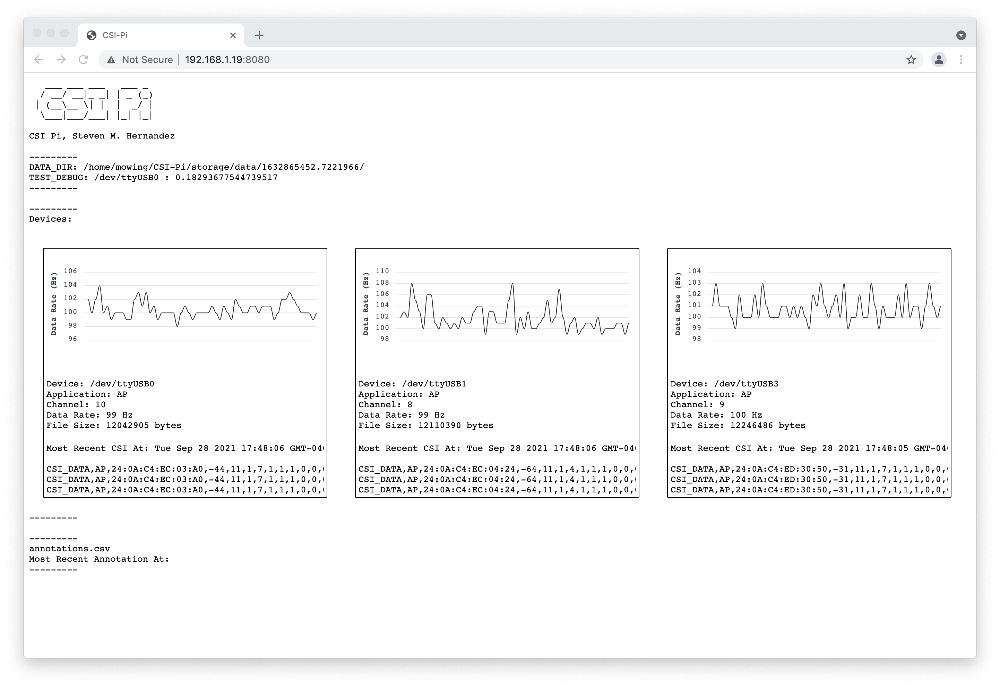
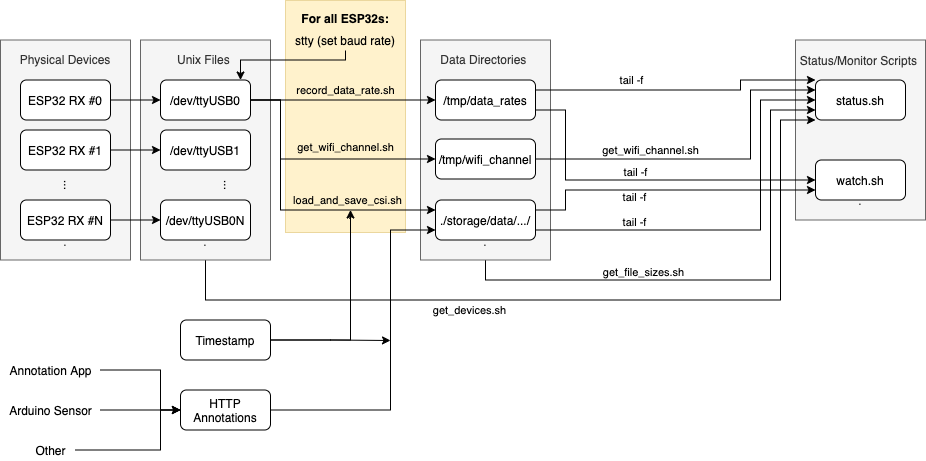
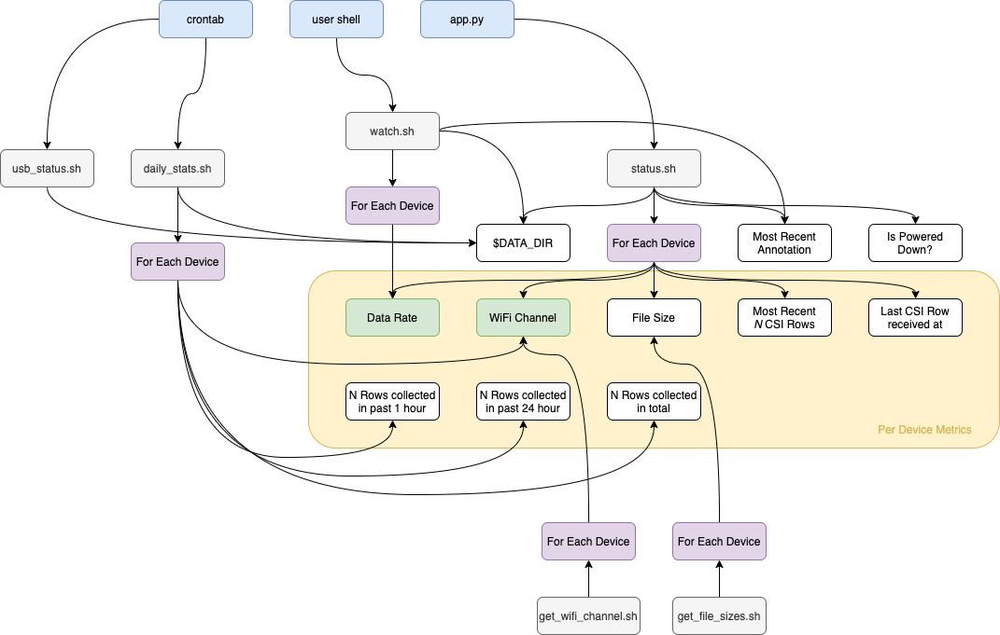

# CSI Pi







## Raspberry Pi Setup

```
sudo apt-get install git python3-pip pv tmux libgirepository1.0-dev 
git clone https://github.com/StevenMHernandez/CSI-Pi.git
cd CSI-Pi
pip3 install -r requirements.txt

# Add your user to the dailout group for non-sudo access to TTY devices
sudo usermod -a -G dialout $USER

# Set Your Local Timezone
sudo dpkg-reconfigure tzdata

# Set the name for the deployment location
echo "example_location_name" > ./name.txt

# Setup automatic USB Flash Drive Backup
# When you plug in a USB flash drive, it should save 
```

## Run Server

```
uvicorn src.csi_pi.app:app --host 0.0.0.0 --port 8080
```

**Note**: a better way to handle this is to automatically run this script on boot. Then you will not need to SSH to start recording. To do this, see **"Run on startup"** below.

View CSI-Pi stats at `http://<PI_IP>:8080` or `http://<PI_HOSTNAME>.local:8080`.

## Annotate CSI Data

Annotating CSI data is currently done through an HTTP endpoint. While the server is running, run the following command

```
curl --location --request POST 'http://<PI_HOSTNAME>.local:8080/annotation?value=<ACTION_OR_MEASUREMENT_VALUE>'
```

## Power Down the USB

To disable collecting data from the ESP32, you can disable to the power (technically, this does not power off the ESP32, but does make the serial data hidden from the Raspberry Pi)

```
curl --location --request POST 'http://<PI_HOSTNAME>.local:8080/power_down'
```

## Power Up the USB

```
curl --location --request POST 'http://<PI_HOSTNAME>.local:8080/power_up'
```

### Ad-hoc Server Stats

If you want to view current status from the terminal run the following:

```
sh src/shell/status.sh
```

## Watch Server Stats

You can watch status of the current annotation file and the data rate per connect ESP32 by running the following:

```
sh src/shell/watch.sh
```

Notice, if you restart the server, you will have to rerun this script otherwise the annotation file will not appear to update.

## Run on startup

You can run the system on boot through the following:

```
# Edit `./csipi.service` depending on your USER and HOME_DIR
sudo cp ./csipi.service /etc/systemd/system/csipi.service
sudo systemctl start csipi.service
sudo systemctl enable csipi.service
```

You can stop and restart the service with the following commands too:

```
sudo systemctl stop csipi.service
sudo systemctl restart csipi.service
```

## USB Flash Drive Auto-backup

Data is stored on the device, but this does not give us an easy way to collect data from the raspberry pi. One method is to mount a usb flash drive to save the files. To achieve, this we need to first setup auto-mount:

```
$ mkdir /home/pi/CSI-Pi/usb_data_dump
$ sudo vim /etc/fstab

# Add the next line to the bottom of the file
/dev/sda1 /home/pi/CSI-Pi/usb_data_dump vfat uid=pi,gid=pi,umask=0022,sync,auto,nosuid,rw,nouser,nofail 0   0 
```

Next, create a new crontab entry which will be run every minute to check if a new USB flash drive was attached:

```
$ crontab -e

# Add the next line to the bottom of the file
* * * * * cd /home/pi/CSI-Pi && /usr/bin/sh src/shell/usb_status.sh
```

Now, every minute, the raspberry pi will check if a USB stick is attached. If the stick is attached, it will copy over the current experiment data to the flash drive. It may take some time to complete this process. As such, the green LED on the raspberry pi will give some status information.

- LED Off: USB device is not attached.
- LED ON: USB device is detected.
- LED BLINKING: Data is being saved to the flash drive. Do not disconnect.

## Common Issues

**Power Supply**. Make sure you have a powerful enough power supply to prevent a brown out. Brown outs can cause the Raspberry Pi to reset randomly, especially when many USB devices are attached.

**ESP32 Module**. Some modules seem to cause more issues than others. *We have not yet figure out why some work very easily and other cause a lot of headaches. Help in analyzing this is appreciated!* 

